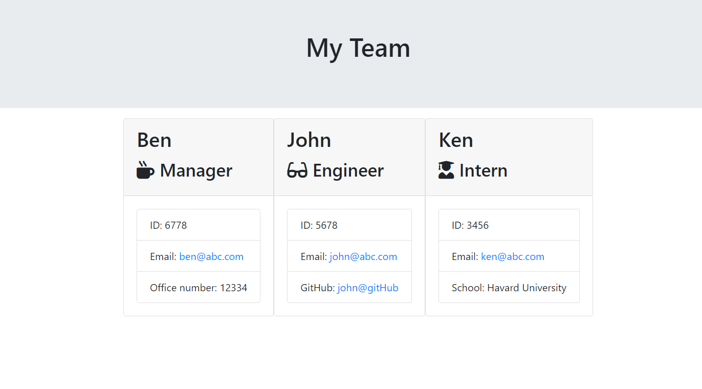

# Company_Team-Profile-Generator

## Description

The aim of this project is to enable user to dynamically generate a webpage that would contain a team members profile. This profile webpage will include the team members name and other basic information such as their email and GitHub. The HTML Webpage would be generated base on the user answer from the prompt questions. The information gathered from their answers would be displayed as summaries on the webpage for each team member. 

## Screen Shot 

The image below shows an example of the web page applications 

